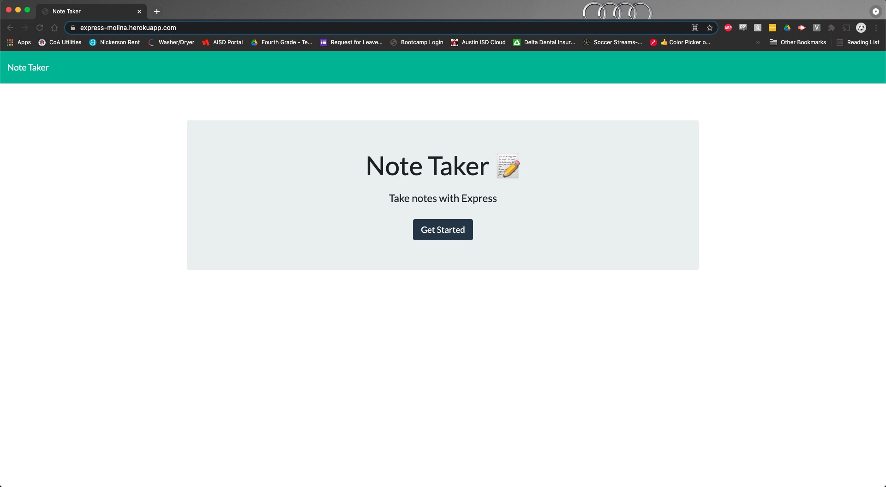
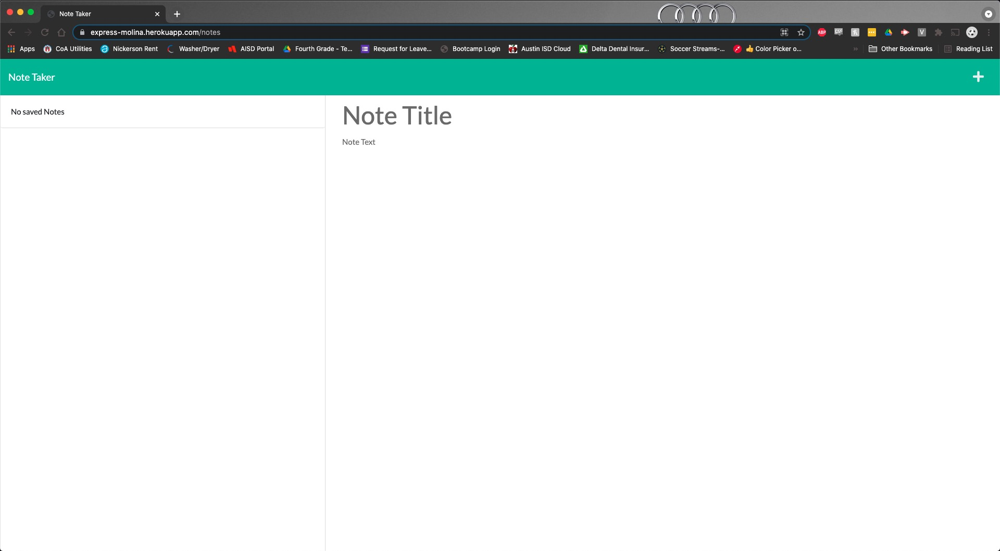
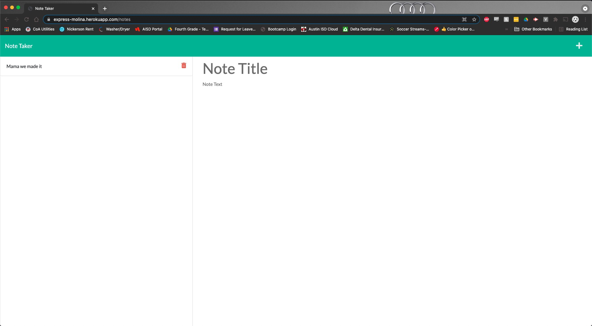
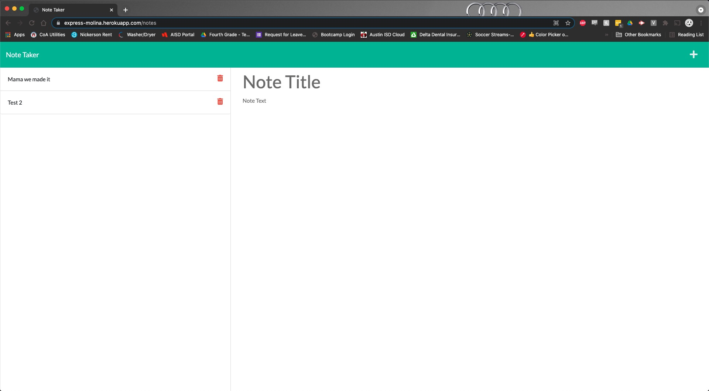

# Note Taker

  

  ## Description
  
  This app allows the user to create notes by adding a title and body text. It stores the notes and allows the user to click the note to view its contents. It also allows the user to delete the note or add a new note. All of the app's functionality is handled by a series of routes that carry out CRUD operations.

  ## Table of Contents

  * [Installation](#installation)

  * [Usage](#usage)

  * [License](#license)

  * [Contributing](#contributing)

  * [Tests](#tests)

  * [Questions](#questions)

  ## Installation

  To install necessary dependencies, run the following command:

  ```
  npm install
  ```
  
  ## Usage

  They need to know what dependencies to install in order to use the app.

  ## Screenshots

  

  

  

  

  ## Contributing

  They need to know how repo works and it's purpose to be able to contribute to the repo.

  ## Tests

  To run tests, run the following command:

  ```
  npm test
  ```

  ## Questions

  If you have any questions about the repo, contact me directly at jmolina721@gmail.com. You can find more of my work at [jmol721](https://github.com/jmol721/).
